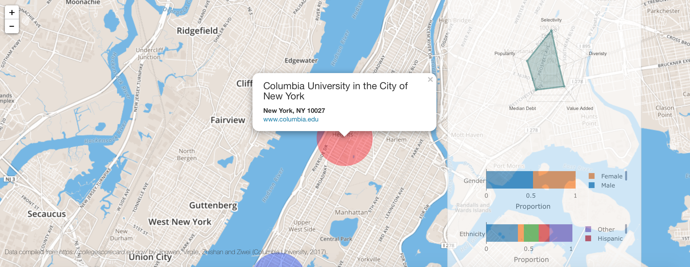

# Project 2: Invest Your Education - an RShiny app development project

### [Project Description](doc/project2_desc.md)



In this second project of GU4243/GR5243 Applied Data Science, we develop an *Exploratory Data Analysis and Visualization* shiny app on a topic of your choice using U.S. government open data released on the [data.gov](https://data.gov/) website. See [Project 2 Description](project2_desc.md) for more details.  

The **learning goals** for this project is:

- business intelligence for data science
- data cleaning
- data visualization
- systems development/design life cycle
- shiny app/shiny server


## Project Title: Invest Your Education
Term: Spring 2017

+ Team Group 12
+ **Team Member**
	+ Zhishan Wang (Presenter)
	+ Ziwei Meng
	+ Virgile Mison
	+ Jingwen Yin
	+ Yi Jiang

+ **Project summary**: This shiny app helps choose the college by location, tuition, majors and we can visualize several key features of each school. It also analyzes the possible factors that can influence the investment in education by linear regression.

**Contribution statement**: Virgile and Jingwen worked on the interactive map tab, and Ziwei and Zhishan worked on the explore data tab.

Following [suggestions](http://nicercode.github.io/blog/2013-04-05-projects/) by [RICH FITZJOHN](http://nicercode.github.io/about/#Team) (@richfitz). This folder is orgarnized as follows.

```
proj/
├── app/
├── lib/
├── data/
├── doc/
└── output/
```

Please see each subfolder for a README file.

